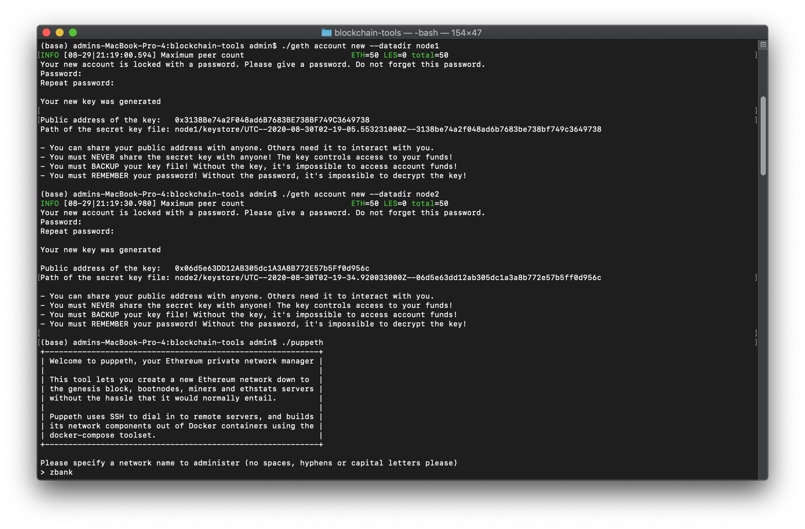
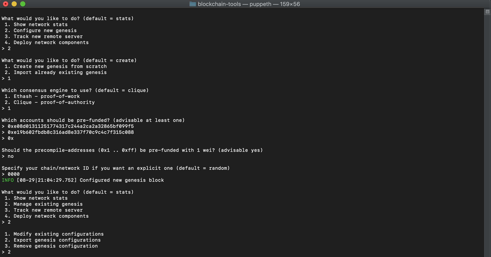
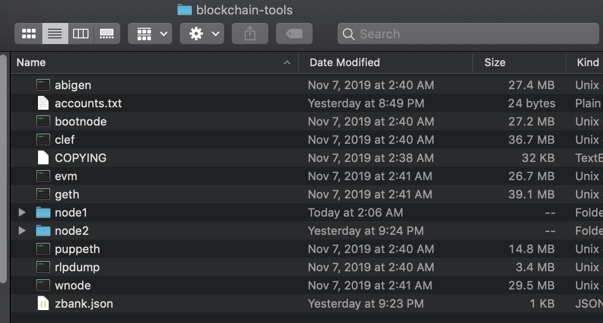
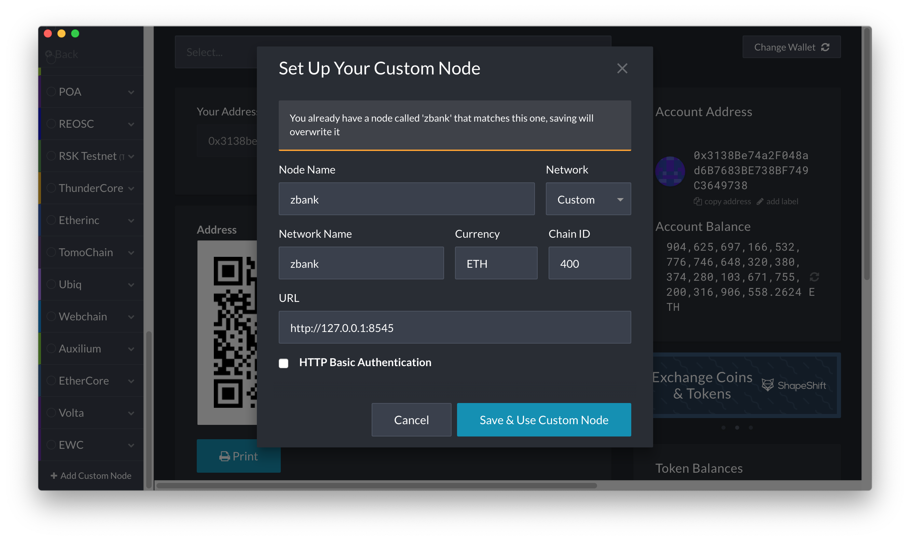
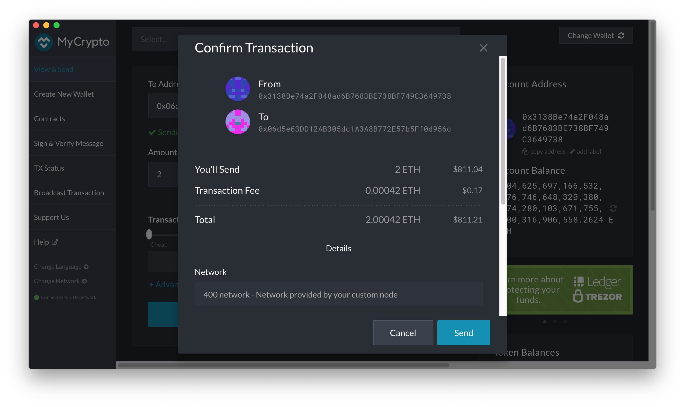
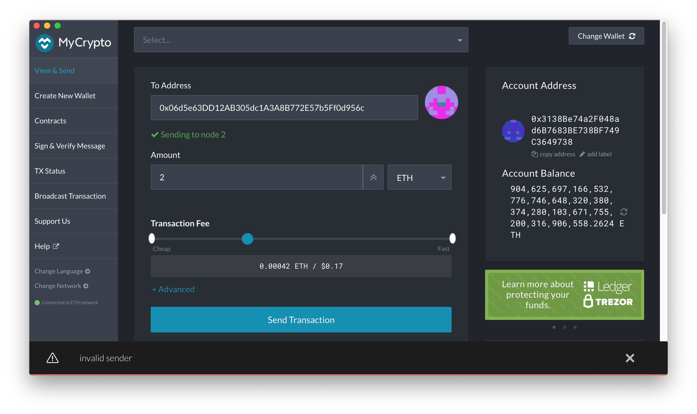

# POA Blockchain Transactions

##  Creating Nodes

1. Add a empty directory for nodes 
```bash
mkdir node1 node2
```

2. Make new accounts from nodes to use as signers
```bash
./geth account new --datadir node1
./geth account new --datadir node2
```

3. Save password and account info for each node
```bash
echo 'node1pswd' > node1/password.txt
echo 'node2pswd' > node2/password.txt
```

```bash
echo 'NODE1adress' >> accounts.txt
echo 'NODE2adress' >> accounts.txt
```



## Running Puppeth

1. Navigate to `blockchain-tools` folder in terminal and enter the following command:

```bash
./puppeth
```

2. Name the network, ie. `zbank`

3. Type `2` to pick the `Configure new genesis` option, then `1` to `Create new genesis from scratch`

4. Type `1` to choose `Proof of Work` and continue, accounts should be address's of node 1 and node 2.

5. After genesis block is configured, Type `2` to pick the `Manage existing genesis` option, then `2` to `Export genesis configuration`



6. `blockchain-tools` folder should now contain `zbank.json` and `zbank-harmony.json` file, you can delete the `zbank-harmony.json` file.



7. Exit the puppeth prompt by using the `Ctrl+C` keys combination.

## Starting the Blockchain

1. Initialize nodes
```bash
./geth init zbank.json --datadir node1
./geth init zbank.json --datadir node2
```

2. launch the first node into mining mode with the following command:
```bash
./geth --datadir node1 --mine --minerthreads 1
```
-  copy the entire `enode://` address (including the last `@address:port` segment) of the first node located in the `Started P2P Networking` line.

3. Launch second node 
```bash
./geth --datadir node2 --port 30304 --rpc --bootnodes "enode://<ENODE ADDRESS FROM ABOVE>" --ipcdisable
```

## Setting Network on MyCrpto

1. Click on "Add Custom Node", then add the custom network information that was set in the genesis.
​
2. Ensure that I scroll down to choose `Custom` in the "Network" setting to reveal more options like `Chain ID`.

3. The URL is pointing to the default RPC port on my local machine. URL: `http://127.0.0.1:8545`.
​
Click on the "Save & Use Custom Node" button, to use the network; double-check that it is selected and is connected.



4. Import the keystore file from th e `node1/keystore` directory into MyCrypto. This will import the private key.

5. Send a transaction from the `node1` account to the `node2` account.

6. Copy the transaction hash and paste it into the "TX Status" section of the app, or click "TX Status" in the popup.

7. The transaction is should now read Succesfull! C with the metadata (status, tx hash, block number, etc).

# Conclusion

I had a problem at the end sending a transaction, said the sender was invalid.




